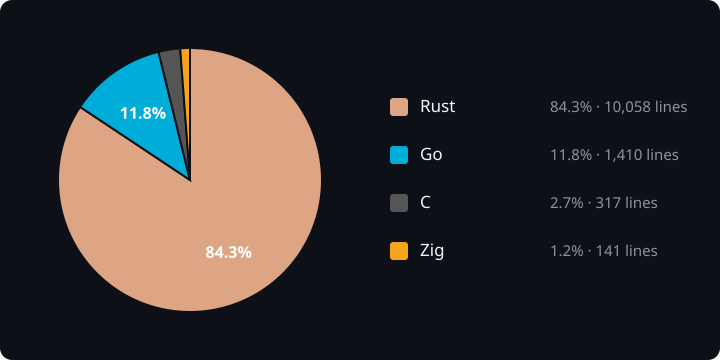

# OpenTerm

Native cross-platform terminal + mini-IDE + SSH client. Polyglot build — each lang doing what it's actually best at.

## stack

| Lang  | Role                                              | Why                                                             |
|-------|---------------------------------------------------|-----------------------------------------------------------------|
| Rust  | UI (egui), process orchestration, local PTY       | Great native UI story, memory-safe, tiny binaries               |
| C     | VT100/xterm escape-sequence parser (`vtparse.c`)  | Called per-byte on every PTY read; tightest possible hot path   |
| Zig   | Terminal grid primitives (`fastgrid.zig`)         | `@memcpy` + comptime kills row scroll / insert / delete ops     |
| Go    | SSH + SFTP sidecar (`otm-agent`)                  | `golang.org/x/crypto/ssh` + `pkg/sftp` are battle-tested        |

Everything communicates in-process (C/Zig via FFI) or over a framed stdio
channel to the Go sidecar. Control messages are newline-delimited JSON; secrets
use separate length-prefixed byte frames and never enter JSON.

### architecture notes

- **Agent transport:** JSON-over-stdio keeps process startup, packaging, and
  cross-platform IPC simple. Bulk SFTP uploads/downloads copy directly between
  local paths and the remote host inside the Go sidecar, so file bytes do not
  pass through JSON. Editor reads/writes still use base64 control messages; if
  OpenTerm later streams large files through Rust, this protocol should move to
  length-prefixed binary frames (for example MessagePack) rather than scaling
  up JSON payloads.
- **Native bindings:** `native.rs` intentionally owns both the C VT parser and
  Zig grid FFI while the surface is small. If more native components arrive,
  split it into `native/mod.rs`, `native/vt.rs`, and `native/grid.rs` before it
  becomes a catch-all bindings file.

<!-- codebase-chart:start -->
## codebase composition

Generated by `build-readme.bat` from non-empty Rust, Go, C, and Zig source lines; build scripts, outputs, and dependencies are excluded.



| Language | Files | Non-empty lines | Share |
|----------|------:|----------------:|------:|
| Rust | 16 | 9962 | 84.4% |
| Go | 4 | 1410 | 11.9% |
| C | 2 | 281 | 2.4% |
| Zig | 1 | 150 | 1.3% |
| **Total** | **23** | **11803** | **100.0%** |
<!-- codebase-chart:end -->

## layout

```
openterm/
├── Cargo.toml           # rust manifest
├── build.rs             # orchestrates cc for vtparse.c + links prebuilt libfastgrid
├── build.bat            # Windows polyglot build orchestrator
├── build-readme.bat     # regenerate README language chart
├── build.sh             # Unix equivalent
├── src/                 # rust source
│   ├── main.rs          # eframe entry
│   ├── app.rs           # UI layout
│   ├── theme.rs         # runtime dark/light palette
│   ├── settings.rs      # theme + default-shell persistence
│   ├── pty.rs           # local shell via portable-pty
│   ├── ssh.rs           # shim over the go agent
│   ├── agent.rs         # framed-stdio client for the Go agent
│   ├── native.rs        # FFI to C parser + Zig grid
│   ├── term.rs          # vt renderer in egui
│   ├── editor.rs        # file tabs + syntect highlighting
│   ├── fs_tree.rs       # sidebar directory walker
│   └── system_info.rs   # readable cross-platform SysInfo commands
├── native/              # C + Zig sources
│   ├── vtparse.c        # vt100/xterm state-machine parser
│   ├── vtparse.h
│   └── fastgrid.zig     # grid scroll/insert/delete primitives
└── agent/               # go sidecar
    ├── main.go          # ssh + sftp daemon
    └── go.mod
```

## requirements

| Tool | Min version | Install / notes |
|------|-------------|-----------------|
| Rust | 1.77 | https://rustup.rs |
| Zig | 0.13 | https://ziglang.org/download/ |
| Go | 1.22 | https://go.dev/dl/ |
| C compiler | any supported | Windows MSVC targets require Visual Studio Build Tools (`cl.exe`) or `clang-cl`; macOS/Linux can use clang or gcc |

optional: `upx` for the `small` build profile.

## build

### Windows

```cmd
build-readme.bat       :: regenerate README.md + language pie chart
build.bat              :: regular release -> dist\regular\
build.bat regular      :: same as above
build.bat portable     :: dist\portable\ with both exes + adjacent openterm.ini
build.bat debug        :: debug
build.bat small        :: release-small + upx
build.bat run          :: build release and launch
build.bat clean        :: nuke target\ and dist\
```

### macOS / Linux

```sh
./build.sh             # regular release -> dist/regular/
./build.sh regular
./build.sh portable    # dist/portable/ with both binaries + adjacent openterm.ini
./build.sh debug
./build.sh small
./build.sh run
./build.sh clean
```

Both scripts do the same three steps in order:

1. **Zig** → compile `native/fastgrid.zig` into `target/native/libfastgrid.{a,lib}`
2. **Go** → compile `agent/*.go` into the selected package directory
3. **Rust** → `cargo build --release` (invokes `build.rs` → `cc` compiles `vtparse.c`, links fastgrid), then copies `openterm{,.exe}` into that package directory

Regular packages contain the two static binaries. Portable packages contain
those same two binaries plus `openterm.ini`; the portable executable reads and
writes that INI beside itself instead of using the OS configuration directory.

## expected sizes (release, stripped)

- `openterm.exe` : ~9–12 MB
- `otm-agent.exe` : ~6–8 MB
- combined with `small` + upx : ~5 MB total

## security

- SSH host keys are checked against `~/.ssh/known_hosts`. First contact shows
  the SHA-256 fingerprint for explicit approval; changed keys hard-fail.
- SSH passwords and key passphrases are held in zeroizing Rust buffers, sent in
  raw length-prefixed frames outside JSON, and cleared by the Go agent after
  authentication. Agent crash dumps are disabled on Unix, and Windows Error
  Reporting is configured to exclude heap contents.
- Saved credentials are encrypted locally with XChaCha20-Poly1305. Password
  vaults derive their key with Argon2id; the master password is never written
  to disk. The derived key is zeroized and memory-locked while the vault is
  open.
- Optional unlock grace stores only the already-derived unlock key in the OS
  credential store (Windows Credential Manager, macOS Keychain, or Linux
  Secret Service), never the master password.

## runtime

OpenTerm looks for `otm-agent` next to its own exe first, then on `PATH`. If missing, local shells still work; the SSH tab will return an error until the sidecar is found.

The settings button controls dark/light appearance and the default shell used
for local tabs (PowerShell, WSL, Bash, or CMD). `Ctrl+T` opens a new tab for the
selected device. Regular builds store settings in the platform configuration
directory; portable builds use the adjacent `openterm.ini`.
